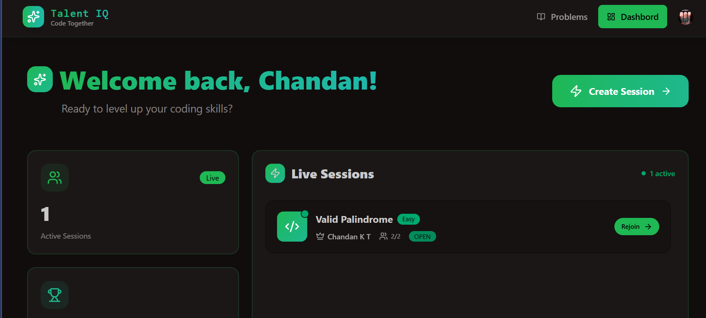
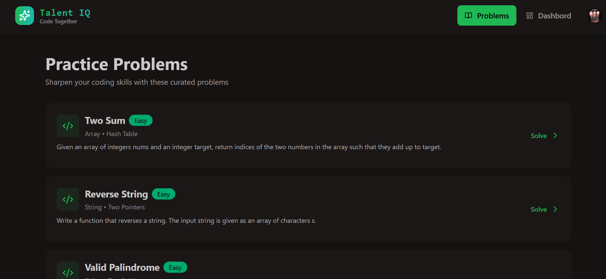
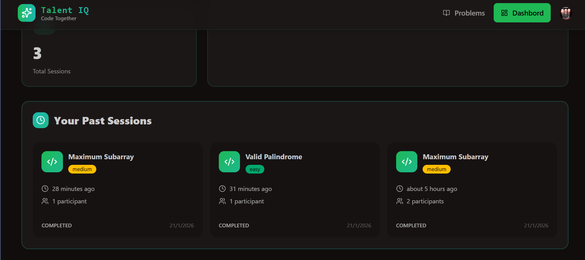
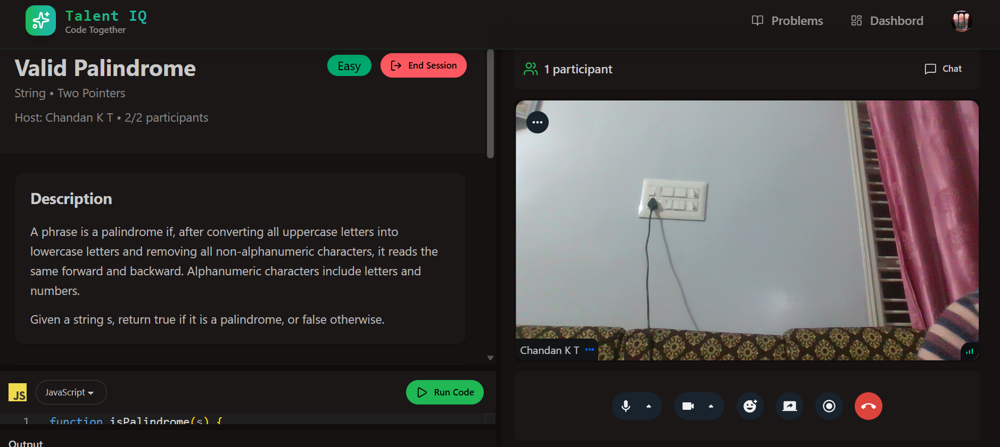

# Talint- Code Together

Talint is a modern, real-time collaborative coding platform designed to help developers practice coding problems, conduct technical interviews, and learn together. It features a live code editor, video conferencing, and a rich library of practice problems.

## 🚀 Live Demo

**[https://talint-mern.onrender.com](https://talint-mern.onrender.com)**

## 📸 Screenshots

_(Please place the screenshots you provided into the `screenshots` folder in the root directory and name them as follows: `dashboard.png`, `problems.png`, `session.png`, `video_call.png`)_

### Dashboard



### Practice Problems



### Active Session



### Video Interview



## ✨ Features

- **Real-time Collaboration**: Live code editing with multiple participants.
- **Video & Audio Chat**: Integrated video conferencing for seamless communication during sessions.
- **Practice Problems**: A curated list of coding problems (Easy, Medium, Hard) to solve.
- **Authentication**: Secure user authentication via Clerk.
- **Interactive Dashboard**: Track your sessions and progress.
- **Multi-language Support**: Code in JavaScript (and extensible to others).
- **Responsive Design**: Modern UI built with Tailwind CSS.

## 🛠️ Tech Stack

### Frontend

- **React**: UI library.
- **Vite**: Build tool.
- **Tailwind CSS**: Utility-first CSS framework.
- **Clerk**: Authentication and user management.
- **Stream**: Video and chat SDKs.
- **Monaco Editor**: VS Code-like editor component.
- **Axios**: HTTP client.

### Backend

- **Node.js & Express**: Runtime and web framework.
- **MongoDB**: NoSQL database for storing users and sessions.
- **Mongoose**: ODM for MongoDB.
- **Stream Chat/Node SDK**: Backend integration for Stream.
- **Inngest**: Serverless event-driven queue (if used).

## 🚀 Getting Started

### Prerequisites

- Node.js (v18+ recommended)
- MongoDB Atlas account
- Clerk account
- Stream account

### Installation

1. **Clone the repository:**

   ```bash
   git clone https://github.com/ChandanKT-git/TalInt.git
   cd TalInt
   ```

2. **Install dependencies:**
   This project is set up as a monorepo. You can install dependencies for both frontend and backend using the root build script or manually.

   **Root (recommended for deployment):**

   ```bash
   npm install
   ```

   **Manual:**

   ```bash
   cd frontend && npm install
   cd ../backend && npm install
   ```

### Environment Variables

Create a `.env` file in **frontend** (`frontend/.env`) and **backend** (`backend/.env`) directories.

**Frontend (`frontend/.env`):**

```env
VITE_CLERK_PUBLISHABLE_KEY=pk_test_...
VITE_API_URL=http://localhost:3000/api
VITE_STREAM_API_KEY=your_stream_api_key
```

**Backend (`backend/.env`):**

```env
PORT=3000
NODE_ENV=development
DB_URL=mongodb+srv://...
CLERK_PUBLISHABLE_KEY=pk_test_...
CLERK_SECRET_KEY=sk_test_...
STREAM_API_KEY=your_stream_api_key
STREAM_API_SECRET=your_stream_secret
CLIENT_URL=http://localhost:5173
```

### Running Locally

1. **Start the Backend:**

   ```bash
   cd backend
   npm run dev
   ```

   Server runs on `http://localhost:3000`.

2. **Start the Frontend:**
   ```bash
   cd frontend
   npm run dev
   ```
   App runs on `http://localhost:5173`.

## 📦 Deployment

This project is configured for deployment on **Render** as a web service.

### Build Command

```bash
npm install && npm run build
```

### Start Command

```bash
npm start
```

### Render Environment Variables

Ensure you add the following Environment Variables in your Render Dashboard:

- `NODE_ENV`: `production`
- `DB_URL`: Your MongoDB connection string.
- `CLERK_PUBLISHABLE_KEY`: Your Clerk Publishable Key (Test/Live).
- `CLERK_SECRET_KEY`: Your Clerk Secret Key.
- `STREAM_API_KEY`: Your Stream API Key.
- `STREAM_API_SECRET`: Your Stream API Secret.
- `CLIENT_URL`: `https://talint-mern.onrender.com`
- `VITE_STREAM_API_KEY`: Same as `STREAM_API_KEY`.
- `VITE_CLERK_PUBLISHABLE_KEY`: Same as `CLERK_PUBLISHABLE_KEY`.

## 🤝 Contributing

Contributions are welcome! Please open an issue or submit a pull request.

## 📄 License

This project is licensed under the ISC License.
